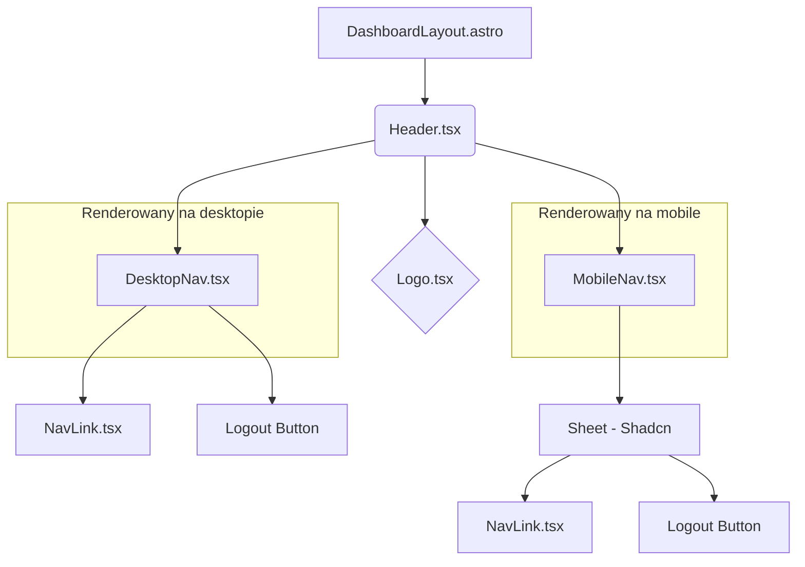

# Plan implementacji widoku: DashboardLayout

## 1. Przegląd

`DashboardLayout` to główny układ (layout) dla wszystkich stron aplikacji wymagających uwierzytelnienia. Jego celem jest zapewnienie spójnej struktury i nawigacji w całej aplikacji. Składa się z responsywnego, stałego nagłówka (Header) zawierającego nawigację główną oraz obszaru na treść (`<slot />`), w którym renderowane są poszczególne strony. Układ jest w pełni responsywny i dostosowuje się do ekranów desktopowych i mobilnych.

## 2. Routing widoku

Ten komponent jest układem Astro (`.astro`) i nie jest przypisany do pojedynczej ścieżki. Będzie on używany przez wszystkie strony "chronione" w aplikacji, takie jak:

- `/` (Dashboard)
- `/clusters`
- `/options`
- `/articles/[id]`

## 3. Struktura komponentów

Komponenty zostaną zorganizowane w sposób hierarchiczny, aby oddzielić logikę od prezentacji i zapewnić reużywalność.



## 4. Szczegóły komponentów

### `DashboardLayout.astro`

- **Opis komponentu**: Główny plik layoutu. Odpowiada za podstawową strukturę HTML (`<head>`, `<body>`), import stylów globalnych oraz renderowanie komponentu `Header` i treści strony (`<slot />`). Przekazuje aktualną ścieżkę URL do komponentu `Header`.
- **Główne elementy**: `<head>`, `<body>`, `<Header client:load />`, `<main>`, `<slot />`.
- **Obsługiwane interakcje**: Brak.
- **Obsługiwana walidacja**: Brak.
- **Typy**: Brak.
- **Propsy**: Brak.

### `Header.tsx`

- **Opis komponentu**: Główny, interaktywny komponent nagłówka. Zarządza stanem (np. widocznością menu mobilnego) i renderuje odpowiednią nawigację (`DesktopNav` lub `MobileNav`) w zależności od rozmiaru ekranu.
- **Główne elementy**: `div` (kontener), `Logo`, `DesktopNav`, `MobileNav`.
- **Obsługiwane interakcje**: Brak (deleguje do komponentów podrzędnych).
- **Obsługiwana walidacja**: Brak.
- **Typy**: `NavItem`.
- **Propsy**:
  - `currentPath: string` - aktualna ścieżka URL, przekazana z `DashboardLayout.astro`.

### `Logo.tsx`

- **Opis komponentu**: Wyświetla logo aplikacji jako klikalny link do strony głównej. Logo będzie prostą, kreatywną grafiką SVG.
- **Główne elementy**: `<a>` (link do `/`), `<svg>`.
- **SVG Logo**:
  ```html
  <svg width="40" height="40" viewBox="0 0 24 24" fill="none" xmlns="http://www.w3.org/2000/svg" class="text-white">
    <circle cx="12" cy="12" r="10" stroke="currentColor" stroke-width="1.5" />
    <path
      d="M12 2C6.47715 2 2 6.47715 2 12C2 17.5228 6.47715 22 12 22C17.5228 22 22 17.5228 22 12C22 6.47715 17.5228 2 12 2ZM12 20V4"
      stroke="currentColor"
      stroke-width="1.5"
      stroke-linecap="round"
      stroke-linejoin="round"
    />
    <ellipse
      cx="12"
      cy="12"
      rx="4"
      ry="8"
      transform="rotate(45 12 12)"
      stroke="currentColor"
      stroke-width="1.5"
      stroke-dasharray="2 2"
    />
    <text x="7" y="17" font-family="sans-serif" font-size="6" fill="currentColor">CO</text>
  </svg>
  ```
- **Obsługiwane interakcje**: `onClick` (nawigacja do `/`).
- **Obsługiwana walidacja**: Brak.
- **Typy**: Brak.
- **Propsy**: Brak.

### `DesktopNav.tsx`

- **Opis komponentu**: Nawigacja dla szerokich ekranów. Wyświetla linki nawigacyjne po lewej stronie i przycisk "Wyloguj" po prawej, z przerwą między nimi. Będzie ukryta na urządzeniach mobilnych.
- **Główne elementy**: `nav` (z `flex justify-between items-center`), `ul` (lista `NavLink`), `Button` ("Wyloguj").
- **Obsługiwane interakcje**: Kliknięcie linku nawigacyjnego, kliknięcie przycisku "Wyloguj".
- **Obsługiwana walidacja**: Walidacja aktywnego linku.
- **Typy**: `NavItem`.
- **Propsy**:
  - `navItems: NavItem[]`
  - `currentPath: string`

### `MobileNav.tsx`

- **Opis komponentu**: Nawigacja dla wąskich ekranów. Wyświetla ikonę "hamburgera". Po kliknięciu otwiera panel (np. `Sheet` z Shadcn/ui) z linkami nawigacyjnymi i przyciskiem wylogowania.
- **Główne elementy**: `Button` (hamburger, z ikoną `Menu` z `lucide-react`), `Sheet`, `SheetTrigger`, `SheetContent`, `SheetHeader`, `SheetTitle`.
- **Obsługiwane interakcje**:
  - `onClick` na hamburgerze: otwiera/zamyka panel.
  - `onClick` na linku: nawiguje i zamyka panel.
- **Obsługiwana walidacja**: Walidacja aktywnego linku.
- **Typy**: `NavItem`.
- **Propsy**:
  - `navItems: NavItem[]`
  - `currentPath: string`

## 5. Typy

Do implementacji widoku potrzebny będzie jeden główny typ ViewModel.

```typescript
// src/types.ts

export interface NavItem {
  /** Etykieta tekstowa linku */
  label: string;
  /** Ścieżka URL, do której prowadzi link */
  href: string;
  /** Opcjonalna ikona do wyświetlenia obok etykiety */
  icon?: React.ComponentType<{ className?: string }>;
}
```

## 6. Zarządzanie stanem

Zarządzanie stanem będzie minimalne i ograniczy się do komponentu `Header.tsx` (lub `MobileNav.tsx`).

- **`isMobileMenuOpen: boolean`**: Stan logiczny (boolean) do kontrolowania, czy mobilne menu nawigacyjne jest otwarte, czy zamknięte.
- **Implementacja**: Użycie hooka `React.useState` wewnątrz komponentu `Header.tsx` (lub `MobileNav.tsx` jeśli użyjemy `Sheet` z Shadcn/ui, który ma wbudowane zarządzanie stanem `open`/`onOpenChange`).

## 7. Integracja API

W obecnym zakresie implementacji nie ma żadnej bezpośredniej integracji z API.

- **Wylogowanie (US-002)**: Przycisk "Wyloguj" będzie istniał w interfejsie, ale jego funkcjonalność będzie "zaślepką". `onClick` nie będzie wywoływał żadnego zapytania do API. W przyszłości będzie on wywoływał `POST /api/auth/logout`.

## 8. Interakcje użytkownika

- **Nawigacja**: Kliknięcie na dowolny link w nawigacji (desktop lub mobile) lub na logo spowoduje przejście do odpowiedniej podstrony.
- **Otwarcie/zamknięcie menu mobilnego**: Na urządzeniach mobilnych, kliknięcie ikony "hamburgera" otworzy panel z nawigacją. Kliknięcie poza panelem, ikony 'X' lub linku nawigacyjnego zamknie go.
- **Kliknięcie "Wyloguj"**: Zarówno na desktopie (w menu użytkownika), jak i w menu mobilnym, kliknięcie "Wyloguj" nie spowoduje żadnej akcji widocznej dla użytkownika (zgodnie z wymaganiami MVP).

## 9. Warunki i walidacja

Jedyną walidacją po stronie UI jest wizualne oznaczenie aktywnego linku w nawigacji.

- **Warunek**: Link jest aktywny, jeśli `currentPath` (przekazany z `DashboardLayout.astro`) jest zgodny z `href` linku.
- **Implementacja**: Porównanie `currentPath` z `item.href`. Dla zapewnienia elastyczności (np. `/clusters/123` powinno podświetlać `/clusters`), można użyć warunku `currentPath.startsWith(item.href)`. Aktywny link otrzyma dodatkowe klasy CSS (np. zmiana koloru, pogrubienie).

## 10. Obsługa błędów

Komponent `DashboardLayout` ma niskie ryzyko wystąpienia błędów w czasie rzeczywistym, ponieważ nie komunikuje się z API i nie przetwarza złożonych danych. Potencjalne problemy, takie jak błędnie skonfigurowane linki, są błędami deweloperskimi, a nie wykonawczymi.

## 11. Kroki implementacji

1.  **Struktura plików**: Utwórz nowe pliki:
    - `src/layouts/DashboardLayout.astro` (jeśli nie istnieje, w przeciwnym razie zmodyfikuj).
    - `src/components/layout/Header.tsx`
    - `src/components/layout/Logo.tsx`
    - `src/components/layout/DesktopNav.tsx`
    - `src/components/layout/MobileNav.tsx`
    - `src/components/layout/NavLink.tsx`
2.  **Typ `NavItem`**: Dodaj definicję typu `NavItem` do `src/types.ts`.
3.  **Logo**: Zaimplementuj komponent `Logo.tsx` z podaną grafiką SVG.
4.  **Komponent `Header.tsx`**: Stwórz szkielet komponentu `Header`. Użyj hooka `useState` do zarządzania stanem menu mobilnego. Dodaj logikę do przełączania widoczności `DesktopNav` i `MobileNav` za pomocą klas Tailwind (`hidden md:flex`, `flex md:hidden`).
5.  **Nawigacja Desktopowa**: Zaimplementuj `DesktopNav.tsx`. Użyj kontenera `flex` z `justify-between`. Po lewej stronie wyrenderuj w pętli listę linków z tablicy `NavItem`. Po prawej stronie umieść przycisk "Wyloguj", który na ten moment nie będzie posiadał żadnej logiki.
6.  **Nawigacja Mobilna**: Zaimplementuj `MobileNav.tsx`. Użyj komponentu `Sheet` z Shadcn/ui. Umieść w nim listę linków oraz przycisk "Wyloguj". Zapewnij, że kliknięcie linku zamknie panel.
7.  **Aktywny link**: W `DesktopNav` i `MobileNav` zaimplementuj logikę podświetlania aktywnego linku na podstawie propa `currentPath`. Użyj `clsx` lub `cn` do warunkowego dodawania klas CSS.
8.  **Layout Astro**: Zaktualizuj `DashboardLayout.astro`. Zaimportuj i umieść komponent `<Header client:load />` wewnątrz `<body>`. Przekaż aktualną ścieżkę jako prop: `<Header currentPath={Astro.url.pathname} />`. Upewnij się, że `<slot />` znajduje się w elemencie `<main>`.
9.  **Stylowanie**: Dostosuj style wszystkich nowych komponentów, aby były spójne z istniejącym wyglądem aplikacji (np. `OptionsView.tsx`). Użyj zmiennych kolorów z Tailwind/Shadcn.
10. **Testowanie**: Ręcznie przetestuj responsywność, przełączając widok w przeglądarce. Sprawdź działanie nawigacji i menu na obu widokach. Upewnij się, że przycisk "Wyloguj" nic nie robi.
